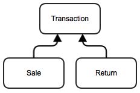

#Department (FRQ - Inheritance) 

Consider a program that keeps track of transactions in a large department store. Both sales and returns are recorded. Three classes - `Transaction`, `Sale`, and `Return` -are used in the program, related as in the following inheritance hierarchy:

Read the given `Transaction` and `Return` classes carefully. Your first exercise is to complete the `Sale` class.

###Part A

Write the code for the `Sale` class. Each `Sale` includes:

* A description of the item being sold.
* The number of this item being sold.
* The cost of this item.
* Whether the sale is cash or credit, stored as a `boolean` variable.
* There is a 10 percent discount for cash payments.

When a new `Sale` is created, it must be assigned an item description, the number being sold, the cost of this item, and whether the sale is cash or credit. Operations on a `Sale` object include the following:

* Retrieve the description of the item being sold.
* Retrieve the quantity of the item being sold.
* Retrieve the cost of the item being sold.
* Retrieve whether the sale is cash or credit.
* Calculate the total for the sale. In calculating this total, a 10 percent discount for paying cash should be applied to the cost before the tax is calculated. (Hint: Discount is discount rate x cost). For this you should override the `getTotal` method.

###Part B
A class called `DailyTransactions` keeps track of all of the transactions at the departments store on a single day. The transactions are contained in an array of `Transaction`s, where each object is a `Sale` or `Return`. 

Write the `getReturnReasons` method for the `DailyTransactions` class, which  returns a list of all of the reasons given for returning items on a given day. 

###Part C
Write the `largestCashSale` method for the `DailyTransactions` class, which finds and returns largest the sales transaction paid for by cash. If there are no cash transactions, it should return `null`.

###Part D

Write the `findTransactionAverage` method for the `DailyTransactions` class, which computes the average of all transactions in a given day. The method `findTransactionAverage` should:

* Compute the total for all transactions.
* Divide by the number of transactions.
* Return the average.

Note that when an item is returned to the store, the amount paid is returned to the customer. For this reason, the `getTotal` method in the `Return` class returns a negative quantity.